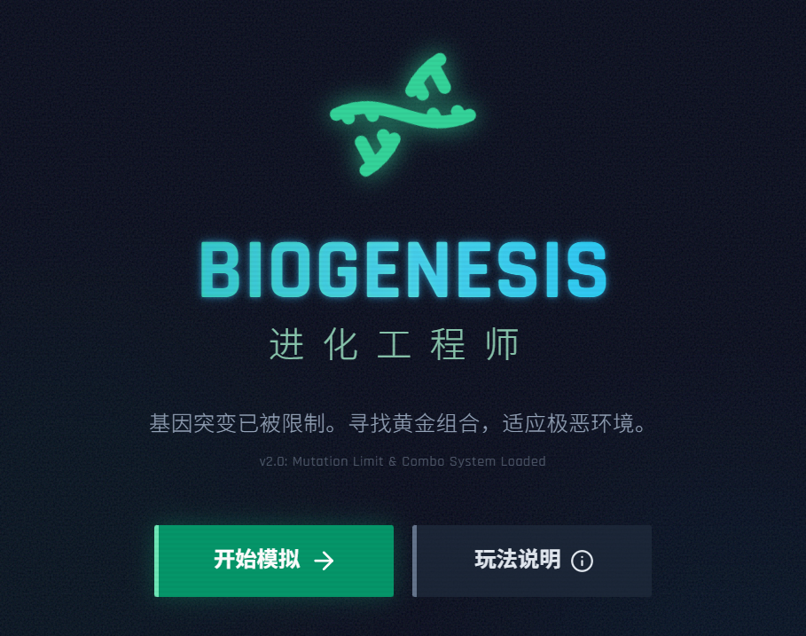
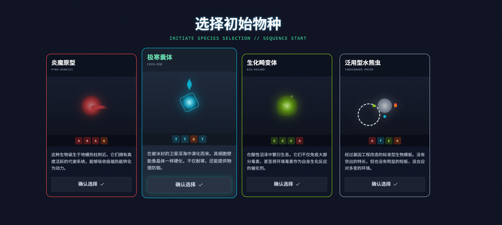
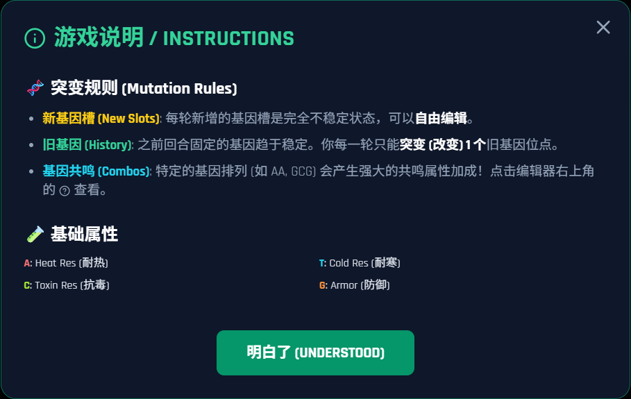
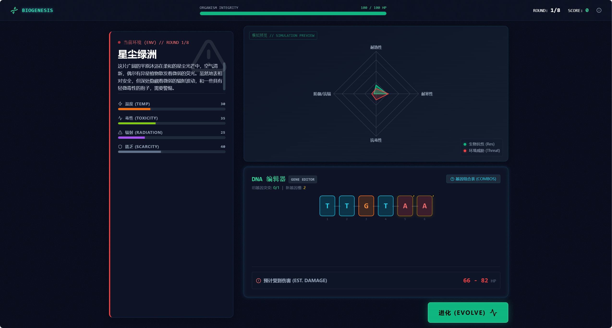

# Biogenesis: 进化工程师 (Evolution Engineer)

**Biogenesis** 是一款结合了生物学概念与策略要素的进化模拟游戏。在这个游戏中，你将扮演一名“进化工程师”，通过编辑物种的 DNA 序列，帮助它们适应不断变化且充满挑战的生存环境。

游戏的核心机制由 **Google Gemini AI** 驱动，能够生成动态的生态环境并评估物种的进化结果，确保每次游玩都是独一无二的体验。



## 🔗 项目链接

- **在线演示**: [http://120.26.178.146:9999](http://120.26.178.146:9999)
- **GitHub 仓库**: [https://github.com/112zjw/Biogenesis\_--.git](https://github.com/112zjw/Biogenesis_--.git)

## ✨ 游戏特色

- **🧬 深度 DNA 编辑系统**：通过调整 ATCG 碱基序列来改变物种的属性（攻击、防御、速度、适应性）。
- **🤖 AI 驱动的动态环境**：利用 Google Gemini 生成不可预测的环境挑战（如“冰河世纪”、“火山爆发”或“高辐射区”）。
- **📊 实时属性可视化**：使用雷达图实时查看物种的各项能力指标。
- **🦁 多样化物种模板**：从不同的基础物种开始你的进化之旅，每个物种都有独特的初始优势。
- **🔄 进化评估系统**：AI 将根据你的 DNA 设计和当前环境，详细推演战斗与生存结果。

## 📸 游戏截图

### 1. 物种选择

选择你的初始物种模板。不同的物种拥有不同的基础 DNA 和属性倾向。


### 2. 游戏说明

了解游戏的核心机制：环境威胁、DNA 突变与属性克制关系。


### 3. 进化与生存 (游戏进行中)

在每一轮中，观察环境预报，调整 DNA 序列以最大化生存率。


## 🛠️ 技术栈

本项目使用现代前端技术构建：

- **核心框架**: [React 19](https://react.dev/)
- **构建工具**: [Vite](https://vitejs.dev/)
- **语言**: [TypeScript](https://www.typescriptlang.org/)
- **AI 模型**: [Google Gemini API](https://ai.google.dev/) (@google/genai)
- **图表库**: [Recharts](https://recharts.org/)
- **图标库**: [Lucide React](https://lucide.dev/)

## 🚀 快速开始

### 环境要求

- Node.js (推荐 v18 或更高版本)
- Google Gemini API Key

### 安装步骤

1.  **克隆仓库**

    ```bash
    git clone <repository-url>
    cd biogenesis-evolution-engineer
    ```

2.  **安装依赖**

    ```bash
    npm install
    ```

3.  **配置环境变量**
    在项目根目录下创建一个 `.env.local` 文件，并添加你的 Gemini API 密钥：

    ```env
    VITE_GEMINI_API_KEY=your_api_key_here
    ```

4.  **启动开发服务器**

    ```bash
    npm run dev
    ```

5.  **打开游戏**
    浏览器访问控制台输出的地址 (通常是 `http://localhost:5173`)。

## 🎮 玩法指南

1.  **开始游戏**：点击首页的“开始进化”按钮。
2.  **选择物种**：挑选一个你喜欢的生物作为进化的起点。
3.  **观察环境**：每一轮 AI 都会生成一个新的环境描述（包含温度、湿度、主要威胁等）。
4.  **编辑 DNA**：
    - 根据环境威胁，策略性地放置 DNA 碱基。
    - **A (腺嘌呤)**: 增加攻击力。
    - **T (胸腺嘧啶)**: 增加防御力。
    - **C (胞嘧啶)**: 增加速度/敏捷。
    - **G (鸟嘌呤)**: 增加环境适应性。
5.  **进化模拟**：提交你的设计，AI 将判定你的物种是否能在当前环境中存活并造成多少伤害。
6.  **生存挑战**：尽可能存活更多轮次，获得更高分数！

## 🤝 贡献

欢迎提交 Pull Requests 或 Issues 来改进游戏体验！

## 📄 许可证

MIT License
